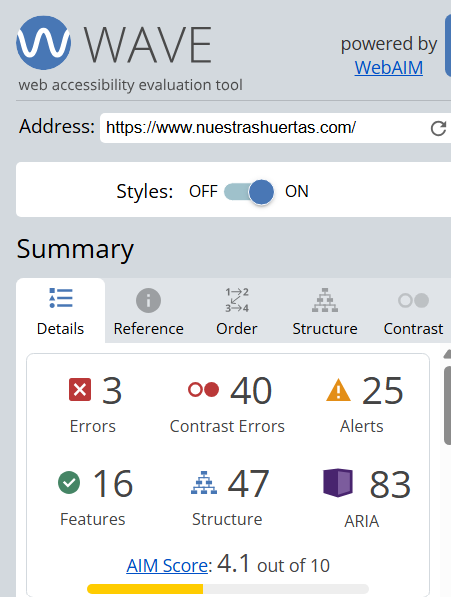
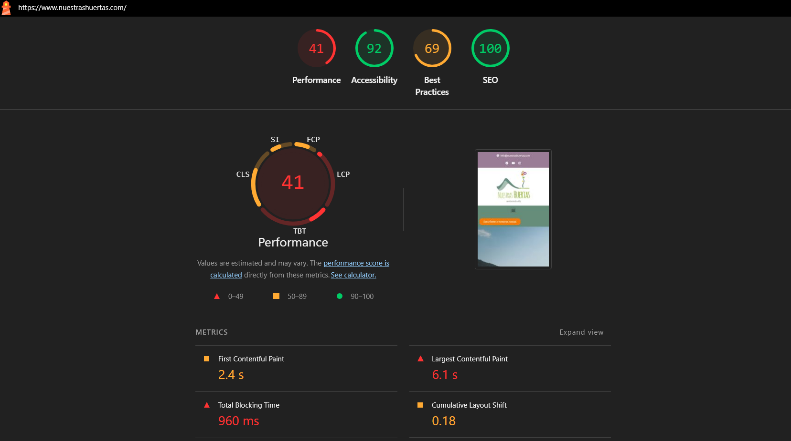

# Trabajo Final DIU - Portfolio UX y ECOMERCADO UGR

## 1. Introducción

Este repositorio recoge el trabajo final de la asignatura Diseño de Interfaces de Usuario. El objetivo del trabajo es, por un lado, realizar una reflexión sobre la experiencia adquirida durante la asignatura en relación con la interfaz de usuario, la experiencia de usuario, la usabilidad y la accesibilidad. Por otro lado, se aplica parte de ese aprendizaje a un caso de estudio relacionado con el ECOMERCADO UGR, analizando referentes reales y planteando una propuesta de mejora desde el punto de vista del diseño centrado en el usuario.

La estructura del trabajo se divide en dos partes principales. En primer lugar, se presenta una autoevaluación de la experiencia UX adquirida a través de las actividades de clase y de la práctica principal desarrollada durante el curso. En segundo lugar, se analiza un caso relacionado con mercados ecológicos y productos de temporada, extrayendo conclusiones e ideas que puedan servir para plantear una propuesta de valor y un diseño inicial para ECOMERCADO UGR.

## 2. Parte I: Mi experiencia UX

Antes de cursar esta asignatura, mi forma de entender el diseño de interfaces era bastante más simple. En general, tendía a pensar que una interfaz estaba bien hecha si visualmente era agradable, si tenía colores bonitos, una estructura moderna y si no daba una sensación demasiado antigua. Sin embargo, a lo largo de las actividades y de la práctica principal he ido cambiando bastante esa forma de verlo. Ahora entiendo mejor que una interfaz no se puede valorar solo por su estética, sino por cómo ayuda realmente al usuario a conseguir lo que quiere hacer, cuánto esfuerzo le supone, si entiende lo que está pasando y si la experiencia le resulta cómoda o frustrante.

Creo que una de las ideas más importantes que me llevo de la asignatura es precisamente esa: una página “bonita” no siempre tiene un buen diseño. Puede tener una paleta atractiva o imágenes cuidadas, pero si el usuario no encuentra la información principal, si los botones no parecen botones, si el menú no responde a lo que espera o si una persona con problemas de visión no puede usarla bien, entonces el diseño falla. Esta idea ha estado presente tanto en las actividades de clase como en la práctica principal, y creo que ha sido una de las que más ha cambiado mi forma de analizar una web.

Las actividades de clase me ayudaron a fijarme en aspectos distintos del diseño. La actividad de etnografía, por ejemplo, me pareció interesante porque no partía de diseñar nada, sino de observar. Al principio puede parecer una actividad sencilla, pero realmente cambia la forma de analizar un problema. No se trataba de inventar una situación, sino de observar una interacción real entre una persona y un objeto o sistema, e intentar detectar dónde aparecía el conflicto. Esto me hizo darme cuenta de que muchos problemas de diseño no se ven desde fuera si no se observa al usuario en su contexto. A veces la persona no dice exactamente qué le molesta, pero sí se nota en sus dudas, en las acciones que repite o en la forma en la que intenta corregir un error.

Esta parte conecta mucho con el factor humano, porque el usuario no actúa como una máquina perfecta. Se equivoca, se distrae, interpreta las cosas según su experiencia anterior y muchas veces intenta resolver la tarea con el modelo mental que ya tiene. Por eso me parece importante no diseñar pensando en un usuario ideal que siempre entiende todo, sino en personas reales, con distintos niveles de experiencia, con prisas, con cansancio o con necesidades diferentes.

Otra actividad que me ayudó bastante fue el moodboard. En este caso el aprendizaje fue más visual, pero no solamente estético. Antes podía pensar que elegir colores, tipografías o imágenes era una cuestión de gusto personal, pero con esta actividad entendí mejor que esas decisiones también forman parte de la experiencia de usuario. Una paleta de colores, una tipografía o una imagen transmiten emociones y pueden hacer que un proyecto parezca más cercano, más serio, más juvenil, más cultural o más tranquilo. No se trata solo de decorar una pantalla, sino de construir una identidad coherente con el tipo de usuario y con lo que se quiere transmitir.

En nuestro proyecto principal esto fue bastante importante, porque en La Estantería de Sabores buscábamos una sensación de tranquilidad, cercanía y acogimiento. Mi aportación en esta parte fue sobre todo intentar que las decisiones visuales no quedaran como algo aislado, sino relacionadas con el tipo de local que estábamos rediseñando. No queríamos que la web pareciese una página genérica de cafetería, sino que transmitiera la mezcla entre cafetería, librería y espacio cultural. Por eso la estética cálida, la paleta “Rustic & Warm”, las tipografías y las imágenes tenían sentido dentro de la propuesta.

También destacaría las actividades relacionadas con evaluación de usabilidad. En la actividad de usabilidad con Heurio, al analizar páginas de universidades andaluzas, se veía claramente que una interfaz puede tener muchos problemas aunque aparentemente funcione. El hecho de marcar problemas, clasificarlos por gravedad y relacionarlos con principios de diseño me pareció útil porque obliga a argumentar mejor. No basta con decir “este menú no me gusta” o “esta página es confusa”, sino que hay que explicar por qué puede afectar al usuario, qué tarea dificulta y qué principio de usabilidad está incumpliendo.

Esto me parece uno de los cambios más importantes que he tenido durante la asignatura. Antes podía detectar que algo “no estaba bien”, pero me costaba justificarlo. Ahora tengo más recursos para explicarlo: puedo hablar de visibilidad, consistencia, prevención de errores, carga cognitiva, claridad de los CTA o facilidad para reconocer información sin tener que recordarla. Evidentemente no soy experto todavía, pero sí noto que tengo una forma más ordenada de mirar una interfaz y detectar problemas.

La actividad de EyeTracking también me pareció muy útil porque muestra algo que muchas veces se supone, pero no siempre se comprueba: el usuario no mira necesariamente donde el diseñador quiere. Al trabajar con POIs como logos, CTA, próximo evento, compra de entradas o redes sociales/contacto, se ve muy claro que la jerarquía visual importa. Si un elemento es importante, no basta con que esté presente en la pantalla. Tiene que estar colocado, destacado y redactado de forma que el usuario lo identifique rápido. Esto me hizo pensar bastante en los CTA, porque a veces diseñamos botones o enlaces pensando que se entienden, pero el usuario puede ignorarlos si no tienen suficiente peso visual o si compiten con demasiada información alrededor.

La accesibilidad fue otra parte que me pareció especialmente importante. En muchas ocasiones se diseña una web pensando en una persona que ve bien, que usa ratón sin problema, que entiende rápido el contenido y que tiene una pantalla cómoda. Sin embargo, en la realidad puede haber personas con baja visión, daltonismo, dificultades motóricas, problemas de comprensión o simplemente situaciones de uso menos favorables, como estar con el móvil en la calle. Las herramientas y simuladores de accesibilidad ayudan a ver estos problemas de una forma más directa. Al probar contrastes, tamaños, comportamiento con baja visión o simuladores de discapacidad, se entiende mejor que la accesibilidad no es un añadido final, sino una parte necesaria del diseño.

Esto también me hizo pensar que muchas mejoras de accesibilidad benefician a todos los usuarios, no solo a personas con una discapacidad concreta. Un mejor contraste, una estructura clara, botones suficientemente grandes o textos más comprensibles hacen que la interfaz sea más cómoda para cualquiera. Por eso creo que en futuros proyectos debería tener más presente la accesibilidad desde el principio, no solo como una comprobación final.

La actividad de microinteracción y estilo UI también aportó una parte diferente. Al trabajar un portfolio con estilo neobrutalism, se veía que una interfaz puede tener mucha personalidad visual sin perder necesariamente usabilidad. Me pareció interesante porque este estilo usa colores llamativos, bordes fuertes, sombras sólidas y composiciones algo más atrevidas, pero aun así tiene que mantener una navegación clara. En esta actividad trabajamos elementos como header, hero section, CTA, cards, footer y estados de botones como hover o press. Estos estados parecen detalles pequeños, pero realmente ayudan al usuario a entender que algo es interactivo y que su acción ha tenido respuesta.

Donde más he podido aplicar todo esto ha sido en la práctica principal, La Estantería de Sabores. En este proyecto seguimos un proceso más completo de diseño centrado en usuario. Primero analizamos el contexto y la web original de La Qarmita, una cafetería-librería cultural de Granada. A partir de ahí vimos que el problema no era solo hacer una web más bonita, sino mejorar cómo se presentaba la información, cómo se entendían los eventos, cómo se transmitía la identidad del local y cómo podía el usuario realizar tareas concretas.

En la fase de investigación trabajamos con análisis competitivo, personas y user journey maps. Los perfiles de Laura y Javier nos ayudaron a no pensar en un usuario abstracto. Laura representaba a una estudiante que busca un sitio tranquilo para leer, estudiar o tomar algo, mientras que Javier era un usuario más interesado en la parte cultural, los eventos y el ambiente creativo. Creo que una de las decisiones más acertadas fue trabajar estos perfiles desde necesidades distintas, porque así el diseño no dependía solo de lo que a nosotros nos parecía útil, sino de lo que cada usuario podía buscar en un espacio así.

Los journey maps nos ayudaron a pensar no solo en la pantalla, sino en la experiencia completa. Un usuario puede llegar con expectativas previas, con dudas, con una intención concreta o incluso con prejuicios sobre el local. Por eso la interfaz debe acompañar esa experiencia, reduciendo incertidumbre y haciendo visibles los elementos importantes. En este sentido, aprendí que la experiencia de usuario no empieza únicamente cuando alguien pulsa un botón, sino antes: cuando busca información, compara opciones, decide si le interesa el sitio y valora si le transmite confianza.

En la parte de ideación usamos herramientas como el mapa de empatía, la malla receptora, la propuesta de valor, la matriz de tareas, los task flows y el sitemap. Al principio algunas de estas herramientas pueden parecer un trámite, pero luego ayudan a ordenar las decisiones. Por ejemplo, el sitemap sirve para organizar mejor los contenidos y evitar que la web crezca de forma desordenada. Los task flows permiten pensar en pasos concretos, como consultar un evento o reservar un espacio, y eso evita diseñar páginas sueltas sin tener claro qué quiere hacer el usuario. En esta fase creo que contribuí especialmente a mantener la relación entre las tareas principales y las secciones que después iban a aparecer en la web.

Después pasamos al diseño visual y al prototipado. En esta fase fue importante mantener coherencia entre la identidad del local y la interfaz. El diseño no debía ser demasiado frío ni genérico, porque el proyecto trataba de un espacio cultural y cercano. Por eso se trabajó una estética cálida, con colores, tipografías y componentes que intentaban transmitir calma y cercanía. También se diseñaron elementos como cards de eventos, agenda, formularios y secciones de presentación del local. Aquí aprendí que un componente no es solo una pieza visual, sino una forma de repetir patrones para que el usuario aprenda más rápido cómo funciona la web.

La evaluación final de la práctica también fue una de las partes más útiles. Usar cuestionarios como SUS, comparar alternativas con A/B testing y analizar resultados nos permitió no depender únicamente de nuestra opinión. En nuestro caso, la propuesta de La Estantería de Sabores obtuvo una valoración SUS alta, lo que reforzaba que el rediseño no solo era más atractivo visualmente, sino también más usable para los participantes. Aun así, creo que lo más importante no fue solo la nota, sino entender que evaluar permite confirmar o corregir decisiones de diseño. Muchas veces uno cree que algo está claro porque lo ha diseñado, pero para un usuario externo no tiene por qué serlo.

A nivel técnico, la exportación final a React y Tailwind también me sirvió para conectar el diseño con la implementación. En otras asignaturas, como en proyectos de desarrollo web o aplicaciones con frontend, muchas veces me había centrado más en que la funcionalidad estuviera implementada y funcionara correctamente. Después de esta asignatura, creo que también tengo más presente si la interfaz se entiende, si los botones tienen sentido, si el usuario recibe feedback y si la estructura le ayuda a completar la tarea. Esto me parece una aportación útil también fuera de DIU, porque al final casi cualquier aplicación que se desarrolla va a ser usada por personas.

Como autoevaluación, creo que mi mayor mejora ha sido aprender a justificar mejor las decisiones. Antes podía decir que una web me parecía confusa o que una sección quedaba bien, pero ahora intento relacionarlo con usuarios, tareas, accesibilidad, jerarquía visual o principios de usabilidad. También he aprendido que diseñar no consiste solo en proponer una solución directamente, sino en investigar antes, idear con cierto criterio, prototipar y evaluar.

Aun así, creo que todavía tengo aspectos que mejorar. Me habría gustado tener más soltura con Figma desde el principio, porque al inicio algunas tareas se hacían más lentas por falta de manejo de la herramienta. También creo que podríamos haber hecho más iteraciones con usuarios reales, ya que muchas veces una sola evaluación da información útil, pero no suficiente para detectar todos los problemas. En accesibilidad también considero que podría profundizar más, sobre todo en cómo aplicar criterios desde el diseño inicial y no solo al revisar el resultado.

En general, mi valoración de la experiencia en la asignatura es positiva. Me ha permitido entender que una buena interfaz no depende solo de que sea visualmente atractiva, sino de que sea clara, accesible, coherente y fácil de usar. También me ha ayudado a ver que el diseño debe basarse en evidencias, aunque sean sencillas, y no únicamente en gustos personales. Creo que la práctica de La Estantería de Sabores resume bastante bien este aprendizaje, porque nos obligó a pasar por un proceso completo: observar, analizar, proponer, diseñar, evaluar y desarrollar. Y precisamente esa es la parte que considero más valiosa: haber entendido que el diseño de interfaces es un proceso, no solo el resultado final de una pantalla.

## 3. Parte II: Caso de estudio ECOMERCADO UGR

En esta segunda parte se analizará un caso de estudio relacionado con mercados ecológicos, productos locales y consumo de temporada, con el objetivo de extraer ideas aplicables a una propuesta de diseño para ECOMERCADO UGR.

La intención no es únicamente describir una web existente, sino analizarla desde criterios de diseño centrado en usuario, usabilidad, accesibilidad y experiencia de usuario. A partir de ese análisis se extraerán conclusiones e insights que sirvan para plantear una propuesta de valor propia para el ECOMERCADO UGR.

### 3.1 Contexto del caso

El caso de estudio elegido para esta parte del trabajo es ECOMERCADO UGR, una iniciativa vinculada a la Universidad de Granada que busca acercar la producción agroecológica, el comercio justo y el consumo responsable a la comunidad universitaria y a la ciudadanía. El proyecto se desarrolla en el entorno del Living Lab Granada Tierra Viva, relacionado con el proyecto europeo SOILCRATES, y cuenta con la participación de la Red Agroecológica de Granada.

El ECOMERCADO UGR se plantea como un espacio de encuentro entre productores locales, entidades sociales, comunidad universitaria y personas interesadas en modelos de consumo más sostenibles. No se trata únicamente de un mercado donde comprar productos ecológicos, sino también de una actividad con valor educativo y social, ya que permite conocer de forma directa a productores, asociaciones e iniciativas vinculadas a la agroecología, la economía social y la alimentación saludable.

La iniciativa se ha celebrado en los Paseíllos Universitarios del Campus de Fuentenueva, un espacio muy reconocible dentro de la Universidad de Granada. En las noticias publicadas por la UGR se presenta como una actividad de carácter periódico o mensual, con ediciones centradas en productos agroecológicos, productos de proximidad, comercio justo, elaboraciones artesanales y actividades de sensibilización.

Desde el punto de vista del diseño de interfaces, este caso resulta interesante porque combina dos tipos de necesidades. Por un lado, existen necesidades informativas muy concretas: saber cuándo se celebra la próxima edición, dónde está situada, cuál es el horario, qué productores participan, qué productos se pueden encontrar y cómo llegar. Por otro lado, también hay necesidades más relacionadas con la experiencia de usuario: transmitir confianza, cercanía, sostenibilidad, claridad y coherencia con los valores del proyecto.

Por tanto, una propuesta digital para ECOMERCADO UGR debería funcionar como un punto de información claro y rápido, especialmente pensado para usuarios que consultan la web desde el móvil. El público potencial puede ser bastante variado: estudiantes que pasan por el Campus de Fuentenueva, profesorado, personal de administración y servicios, vecinos de Granada o personas interesadas en alimentación ecológica y consumo local. Esto hace necesario diseñar una interfaz sencilla, accesible y orientada a resolver dudas prácticas desde los primeros segundos.

En este trabajo se plantea ECOMERCADO UGR como el caso final sobre el que aplicar los aprendizajes obtenidos durante la asignatura. Para ello, primero se analiza un referente real relacionado con mercados ecológicos y productos de temporada, y después se extraen insights que permitan definir una propuesta de valor y una primera solución de interfaz para el ecomercado universitario.

### 3.2 Análisis de referente: Nuestras Huertas

Para el análisis del referente se ha seleccionado la web **Nuestras Huertas**, un proyecto centrado en fruta y verdura ecológica, cestas semanales y mercados ecológicos en la Comunidad de Madrid. Se ha elegido este caso porque comparte varios elementos con el futuro ECOMERCADO UGR: producto ecológico, cercanía con productores, consumo responsable, mercados presenciales y necesidad de comunicar información práctica como horarios, ubicaciones y formas de participación.

La intención de este análisis no es rediseñar la web de Nuestras Huertas, sino observar qué decisiones funcionan bien, qué problemas aparecen y qué aprendizajes pueden aplicarse después a una propuesta propia para ECOMERCADO UGR.

#### Captura general del referente

A primera vista, la web transmite bien la identidad del proyecto. El uso de fotografías de huerta, colores naturales y mensajes como “sembrando vida” o “te llevamos al huerto” ayuda a comunicar una imagen cercana, ecológica y coherente con el tipo de producto que se ofrece. También aparece un CTA visible en la zona superior, “Suscríbete a nuestras cestas”, lo que permite entender que una de las acciones principales de la web es conseguir suscriptores para el servicio de cestas.

Sin embargo, la página funciona como una landing bastante larga, con muchas secciones seguidas: presentación del proyecto, propuesta de valor, huerta, vídeo, mercados, blog, reseñas, mapa, newsletter y footer. Esto permite ofrecer mucha información, pero también puede aumentar la carga cognitiva del usuario si entra buscando un dato concreto. En el caso de ECOMERCADO UGR, donde probablemente muchos usuarios solo quieran saber fecha, horario, ubicación o productores participantes, sería importante priorizar la información más inmediata desde el principio.

#### Propuesta de valor y comunicación

Uno de los puntos fuertes de la web es que comunica de forma clara su propuesta de valor: fruta y verdura ecológica directa a casa. Además, divide esta idea en tres bloques fáciles de entender: **huerta propia**, **mejores productores** y **cestas semanales**. Esta estructura ayuda al usuario a comprender rápidamente qué ofrece el proyecto y por qué puede confiar en él.

Este enfoque es útil para ECOMERCADO UGR, porque demuestra que una iniciativa ecológica no debería limitarse a mostrar información suelta, sino explicar de forma clara qué aporta. En el caso del ecomercado universitario, una estructura similar podría presentar tres ideas clave: productos locales, productores agroecológicos y actividades abiertas a la comunidad universitaria.

#### Información sobre mercados

La sección de mercados es una de las más interesantes para este trabajo, porque se parece bastante al tipo de información que debería aparecer en ECOMERCADO UGR. La web muestra distintos mercados mediante tarjetas con nombre, dirección, frecuencia y horario. Esta solución es visualmente clara y permite comparar varios puntos de venta.

Aun así, desde el punto de vista de la usabilidad, se detecta una posible mejora: la información aparece distribuida en varias tarjetas, pero no se destaca cuál es el próximo mercado ni hay un CTA directo tipo “Cómo llegar”, “Ver en mapa” o “Añadir al calendario”. Para un usuario que entra con prisa, especialmente desde móvil, esta información debería estar más priorizada.

De esta sección se extrae un insight importante para ECOMERCADO UGR: la página principal debería incluir una tarjeta destacada con la **próxima edición**, indicando fecha, horario, lugar y botones directos como “Cómo llegar” o “Ver productores”.

#### Versión móvil

[Ver versión móvil de Nuestras Huertas](img/analisis_referentes/nuestras-huertas-movil.png)

En la versión móvil, la web mantiene el contenido principal y adapta las secciones en formato vertical. Esto es positivo porque permite consultar la página desde un dispositivo móvil, que probablemente será uno de los contextos de uso más habituales. Sin embargo, también se aprecia que la página se vuelve muy larga. El usuario tiene que hacer bastante scroll para llegar a secciones como mercados, blog, reseñas o contacto.

Este punto es importante para ECOMERCADO UGR. En una web pensada para un mercado universitario, la experiencia móvil debería ser más directa. Lo más importante debería aparecer en los primeros bloques: próxima edición, ubicación, horario, productos o productores destacados y acceso a información práctica. El contenido más secundario, como noticias, explicación del proyecto o newsletter, puede aparecer después.

#### Evaluación de accesibilidad con WAVE

Para complementar el análisis visual se utilizó la herramienta WAVE, con el objetivo de detectar problemas automáticos de accesibilidad. El resultado muestra **3 errores**, **40 errores de contraste**, **25 alertas**, **16 features**, **47 elementos estructurales**, **83 elementos ARIA** y un **AIM Score de 4.1/10**.

El problema más relevante es el número de errores de contraste. Aunque visualmente la web tiene una estética coherente con el producto ecológico, algunos textos pueden no tener suficiente contraste con el fondo. Esto afecta especialmente a personas con baja visión, usuarios con pantallas pequeñas o personas que consultan la web en exteriores, donde la luz dificulta la lectura. También aparecen problemas relacionados con imágenes enlazadas sin texto alternativo, textos alternativos redundantes, enlaces redundantes y saltos en niveles de encabezado.

Desde el punto de vista experto, esto indica que la web tiene una identidad visual reconocible, pero no todos los elementos están resueltos correctamente desde accesibilidad. Para ECOMERCADO UGR, esto implica que la propuesta debe cuidar desde el principio el contraste, la jerarquía de encabezados, los textos alternativos y la claridad de los enlaces. La accesibilidad no debería tratarse como una revisión final, sino como un criterio de diseño desde el inicio.

#### Evaluación con Lighthouse

También se realizó una evaluación con Lighthouse en modo móvil. Los resultados obtenidos fueron:

- **Performance:** 92
- **Accessibility:** 69
- **Best Practices:** 100
- **SEO:** 41

La puntuación de rendimiento es buena en general, aunque algunas métricas concretas muestran margen de mejora. El **Largest Contentful Paint** fue de 6.1 segundos, el **Total Blocking Time** de 960 ms y el **Speed Index** de 5.5 segundos. Esto indica que, aunque la web obtiene una puntuación global positiva, algunos elementos principales pueden tardar en aparecer o dificultar la interacción inicial.

La puntuación de accesibilidad, 69, confirma algunos de los problemas detectados con WAVE: contraste insuficiente, enlaces sin nombre discernible, encabezados no ordenados de forma secuencial y ausencia de un landmark `main`. Por otro lado, la puntuación de Best Practices es muy alta, lo que indica que la web está razonablemente bien resuelta a nivel técnico general. El SEO, en cambio, obtiene una puntuación baja, algo relevante para una iniciativa que depende de que los usuarios puedan encontrar fácilmente información sobre productos ecológicos, mercados o puntos de venta.

Para ECOMERCADO UGR esto permite extraer otra conclusión: una web de este tipo debe ser ligera, accesible y fácil de encontrar. No basta con que la página sea visualmente atractiva; también debe cargar rápido, estar bien estructurada y permitir que la información principal sea localizable tanto por usuarios como por buscadores.

### 3.3 Problemas e insights detectados

A partir del análisis de Nuestras Huertas se pueden extraer varios aprendizajes aplicables a ECOMERCADO UGR.

| Aspecto analizado | Observación en Nuestras Huertas | Insight para ECOMERCADO UGR |
|---|---|---|
| Propuesta de valor | La web comunica bien la idea de producto ecológico directo a casa. | ECOMERCADO UGR debe explicar claramente qué ofrece: productos locales, productores agroecológicos y actividades universitarias. |
| CTA principal | El CTA “Suscríbete a nuestras cestas” está visible en la navegación. | El CTA principal de ECOMERCADO UGR debería estar orientado a la acción más inmediata: “Ver próxima edición” o “Cómo llegar”. |
| Información de mercados | Las tarjetas muestran dirección, horario y frecuencia de cada mercado. | La información de fecha, horario y ubicación debe aparecer en tarjetas claras, pero destacando siempre la próxima edición. |
| Versión móvil | La web se adapta, pero se vuelve muy larga y requiere bastante scroll. | La versión móvil de ECOMERCADO UGR debe priorizar la información esencial en los primeros bloques. |
| Accesibilidad | WAVE detecta muchos errores de contraste y varios avisos estructurales. | La propuesta debe cuidar contraste, encabezados, textos alternativos y enlaces accesibles desde el inicio. |
| Confianza | La web usa reseñas, mapa, redes sociales y datos de contacto. | ECOMERCADO UGR debería incluir elementos de confianza: productores, entidades participantes, ubicación real y contacto claro. |
| Contenido secundario | Blog, reseñas y newsletter enriquecen la web, pero aumentan la longitud. | El contenido secundario debe estar presente, pero no competir con la información práctica del mercado. |

En resumen, Nuestras Huertas funciona bien como referente porque transmite cercanía, producto ecológico y confianza. También muestra de forma útil la información sobre mercados presenciales. Sin embargo, el análisis evidencia que una web de este tipo puede volverse demasiado extensa y presentar problemas de accesibilidad si no se cuidan el contraste, la estructura y la jerarquía de contenidos.

Para ECOMERCADO UGR, el principal aprendizaje es que la interfaz debe ser más directa. La página principal debería responder rápidamente a las preguntas básicas del usuario: **cuándo es el próximo mercado, dónde se celebra, qué horario tiene, qué productores participan y cómo llegar**. A partir de ahí, se pueden añadir secciones secundarias sobre el proyecto, actividades, noticias o participación.
### 3.4 Propuesta de valor para ECOMERCADO UGR

Pendiente de desarrollar.

En este apartado se planteará qué debería aportar la propuesta digital de ECOMERCADO UGR a sus usuarios, teniendo en cuenta tanto la información práctica como la experiencia de uso.

### 3.5 Propuesta de diseño

Pendiente de desarrollar.

En este apartado se incluirá el boceto o mockup de la propuesta, junto con una breve explicación de las decisiones de diseño tomadas.

## 4. Conclusiones

Pendiente de desarrollar.

En este apartado se recogerán las conclusiones generales del trabajo, relacionando la experiencia adquirida durante la asignatura con la propuesta realizada para ECOMERCADO UGR.

## 5. Referencias

Pendiente de completar.

* Guion del trabajo final de DIU.
* Material teórico de la asignatura Diseño de Interfaces de Usuario.
* Actividades prácticas realizadas en clase.
* Práctica principal: La Estantería de Sabores.
* Recursos relacionados con usabilidad, accesibilidad y diseño centrado en usuario.
